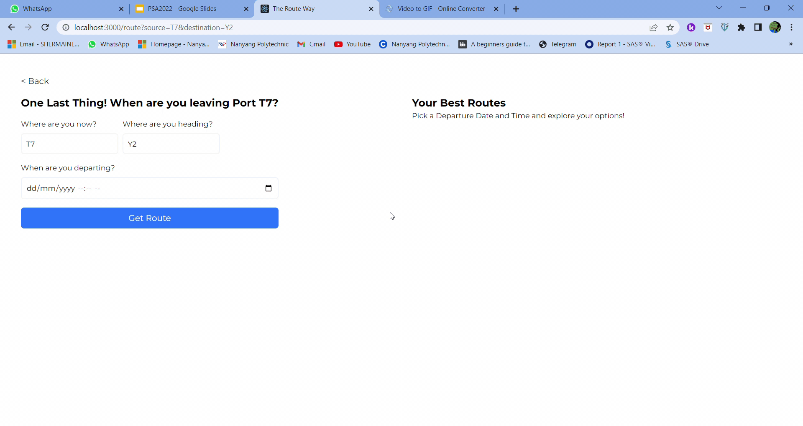
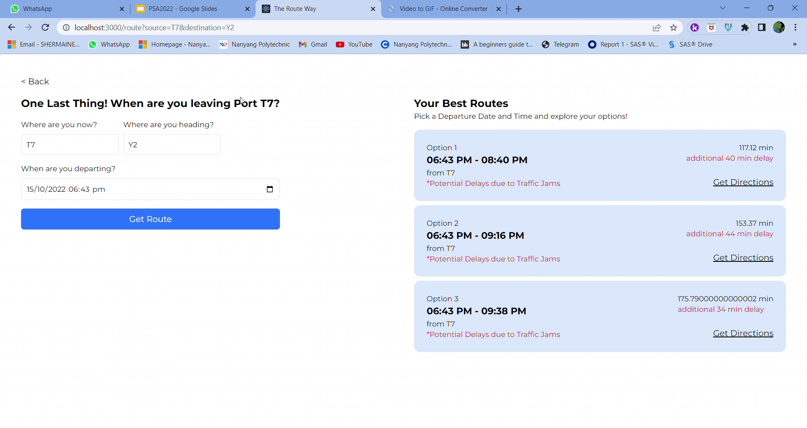

# PSA Hackathon

Side Project Done for PSA Hackathon 2022. A Traffic Management in Terminal Yard (PS5) With Optimum Route Algorithm & Traffic Delay Prediction.
<br/>
The Idea:
- Develop an Optimal Route algorithm to provide the best route, avoiding delays.
- Make Early Predictions of Delays so route plans can be made ahead of time.
- Provide multiple route options, so freedom of choice is still present.

<br><br>
<br><br>
<br><br>


### Setting Up
In your clientside env file put this
```
# use this when you talk to the api
REACT_APP_API_ENDPOINT=http://localhost:3001
```

In your serverside env file put this
```
FLASK_secret = "123secret"
```

Install the necessary libraries in the frontend (./client) and backend (./server) </br>
In Frontend: ```npm i``` to install all libraries needed as listed in package.json </br>
In Backend: ```pip install -r requirements.txt``` to install all libraries needed as listed in requirements.txt

### Running the App
We need 2 terminals to run the frontend and backend of the App.
client side runs at 3000
server side runs at 3001

First Terminal for Backend:
```
cd server
py main.py
```
Second Terminal for Frontend:
```
cd client
npm run start
```

Test the App with these information:
- Source PORT: T7
- Destination PORT: Y2
- When are you departing: Try Anytime

OR
- Source PORT: T2
- Destination PORT: X4
- When are you departing: Try Anytime

OR
- Source PORT: U3
- Destination PORT: Y7
- When are you departing: Try Anytime

### About the App Directories
client is our frontend while server is our backend. 

training.csv and ml.py are in the root directory, where training.csv is the dummy dataset with mock up deliveries used to train our AI model. 

The trained model is saved into model.h5 which resides in our server.
